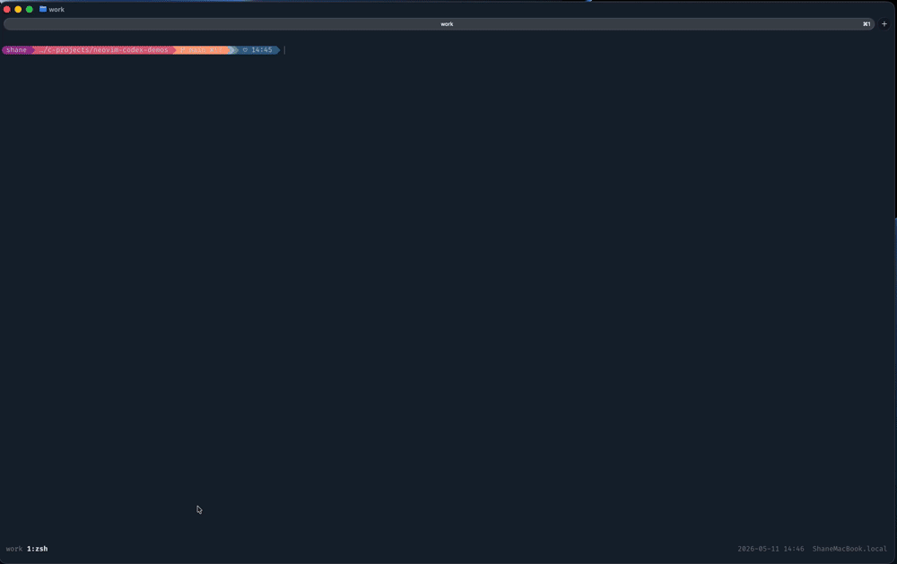
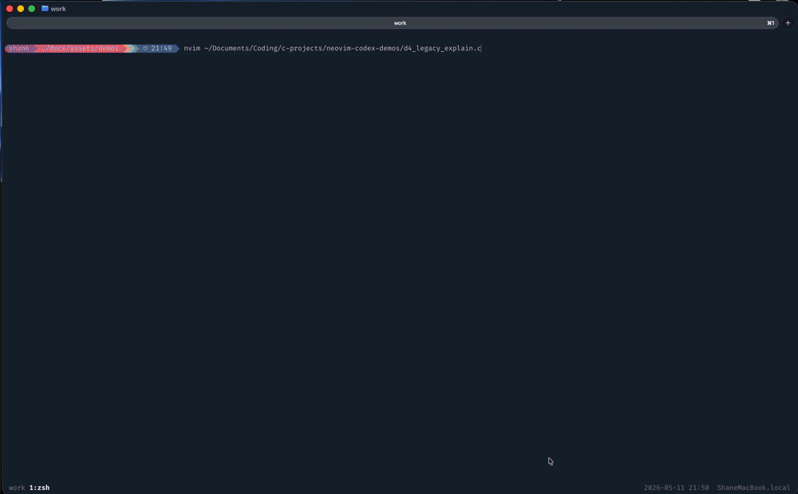
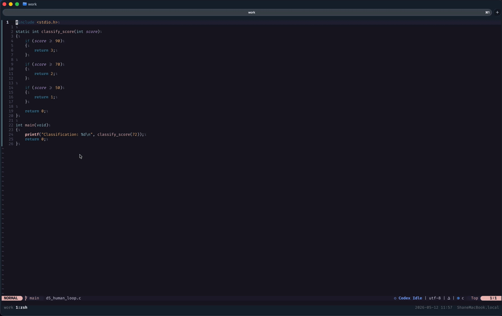

# Neovim-Codex RC1.0

AI-Assisted Engineering System (AIES) for Neovim.

Neovim-Codex is designed for users who want confidence working with AI-assisted workflows that are:

- correct
- controllable
- traceable
- recoverable
- reproducible

Most AI coding workflows optimise for speed and automation.

Neovim-Codex instead optimises for:

- transparency
- operational safety
- human review
- deterministic engineering workflows
- inspectable behaviour

The goal is not autonomous coding.

The goal is engineering confidence:
AI-assisted workflows that remain understandable, observable, and trustworthy.

---



---

# Why Neovim-Codex Exists

Neovim-Codex was built around a simple premise:

AI-assisted engineering systems should increase confidence, not reduce it.

The system is intentionally designed to favour:

- preview-before-apply workflows
- explicit user approval
- operational observability
- deterministic execution
- recoverable failure handling
- validation before mutation

This project behaves more like an engineering system than a generic AI editor plugin.

The user always remains in control.

No silent apply path exists.

---

# Core Principles

## Correctness

Generated changes should validate before apply.

Examples:

- clang / clang++ validation
- constrained refactor flows
- preflight health checks

---

## Control

The user remains in control.

The system emphasises:

- diff previews
- explicit confirmation
- no silent auto-apply
- constrained rewrite scopes

---

## Traceability

Operational events are logged.

Examples:

- prompt execution
- latency
- failures
- validation
- apply events

---

## Recoverability

Failures are treated as operational events rather than hidden behaviour.

The system captures:

- validation failures
- recovery state
- operational diagnostics
- workflow state transitions

---

# Supported Platforms

| Platform | Status       |
| -------- | ------------ |
| macOS    | Supported    |
| Linux    | Experimental |
| Windows  | Unsupported  |

RC1.0 is primarily developed and tested on macOS Apple Silicon.

---

# Requirements

## Required

- Neovim 0.10+
- git
- clang
- diff

## Optional

- Node.js
- npm
- Codex CLI
- authenticated OpenAI/Codex account

Without Codex CLI authentication, AI-assisted workflows will be unavailable.

---

# Quick Start

## 1. Clone the Repository

```bash
git clone https://github.com/shanedowley/neovim-codex.git ~/.config/nvim
```

---

## 2. Run Bootstrap Validation

Fast validation:

```bash
./scripts/bootstrap-nvim-codex-rc1_0.sh --check
```

Full sync:

```bash
./scripts/bootstrap-nvim-codex-rc1_0.sh --sync
```

Health gate integrity test:

```bash
./scripts/bootstrap-nvim-codex-rc1_0.sh --test-health-gate
```

---

## 3. Launch Neovim

```bash
nvim
```

---

## 4. Verify Operational Health

Inside Neovim:

```text
:CodexHealth
```

Then:

- open a C/C++ source file
- visually select code
- press `<leader>cE`

This demonstrates the explainability workflow operating inside the validated runtime environment.

---

# Demo Workflows

## D1 — Safe Refactor Workflow

Demonstrates:

- preview-first rewrites
- explicit apply confirmation
- clang validation
- controlled code mutation


See:

- `docs/demos/D1_SAFE_REFACTOR.md`

---

## D2 — Failure Recovery and Explainability

Demonstrates:

- validation rejection
- protected active buffers
- recovery capture
- failure explainability
- operational recovery workflows


See:

- `docs/demos/D2_FAILURE_RECOVERY.md`

---

## D3 — Operational Diagnostics

Demonstrates:

- operational health checks
- workflow state tracking
- latency telemetry
- structured logging
- operational observability


See:

- `docs/demos/D3_OPERATIONAL_DIAGNOSTICS.md`

---

## D4 — Legacy Code Explainability

Demonstrates safe AI-assisted reasoning about existing C systems without modifying source code.



See:

- `docs/demos/D4_LEGACY_EXPLAINABILITY.md`

---

## D5 — Human-in-the-Loop Engineering

Demonstrates iterative refinement where the user reviews, rejects, refines, and explicitly approves generated output.



See:

- `docs/demos/D5_HUMAN_LOOP.md`

---

# Core Commands

## Explain Selected Code

Select code in visual mode:

```text
<leader>cE
```

---

## Rewrite Selected Code

Select code in visual mode:

```text
<leader>ce
```

---

## Refactor Current Function

Place cursor inside a function:

```text
<leader>cR
```

---

## Reopen Diff Preview

```text
<leader>cd
```

or:

```text
<leader>cD
```

---

# Architecture & Documentation

## Core Documentation

- `ARCHITECTURE.md`
- `INSTALL.md`
- `RELEASE_NOTES_RC1_0.md`
- `RELEASE_CHECKLIST.md`

## Operational Documentation

- `codex/docs/OPERATIONS.md`
- `codex/docs/RELEASE_SCOPE.md`
- `codex/docs/REPO_AUDIT.md`

---

# Current RC1.0 Scope

Primary focus:

- macOS
- Neovim
- C/C++ engineering workflows
- safe AI-assisted refactoring
- operational observability

Secondary support exists for broader workflows inside the surrounding Neovim environment.

Linux support remains experimental.

Windows is currently unsupported.

---

# What This Is Not

Neovim-Codex is intentionally not:

- an autonomous coding agent
- a silent background mutator
- a zero-review apply system
- an “AI does everything” workflow

The architecture intentionally preserves explicit user control.

---

# Future Direction

Planned future areas include:

- Linux hardening
- Windows / WSL support
- CI validation pipelines
- OpenRouter abstraction
- OpenCode integration exploration
- multi-language expansion
- telemetry standardisation
- advanced recovery tooling
- standalone plugin extraction

---

# Closing Notes

Neovim-Codex RC1.0 represents a deliberate attempt to build an AI-assisted engineering workflow that remains:

- observable
- inspectable
- deterministic
- safe
- user-controlled

The goal is not maximum automation.

The goal is engineering confidence.
