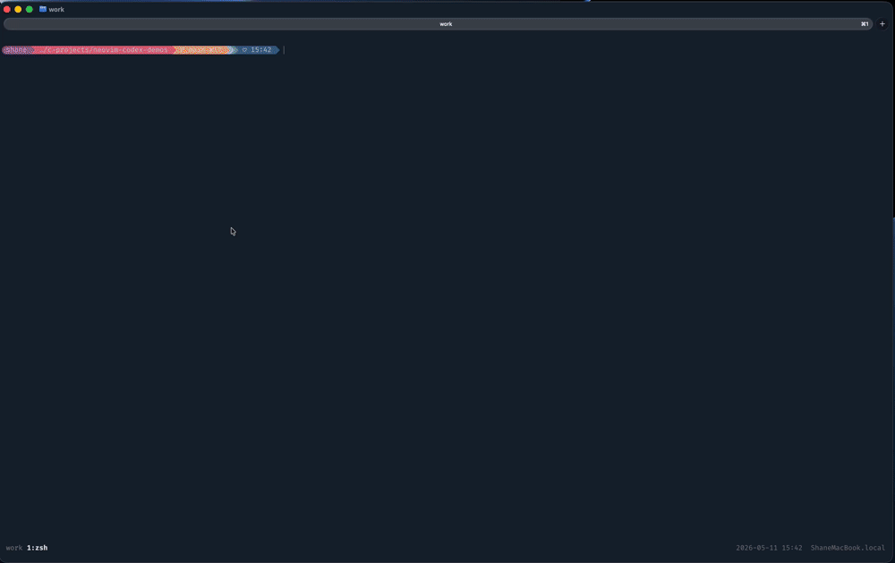

# D2 — Failure Recovery and Explainability Demo

## Purpose

Demonstrates how Neovim-AIDE safely handles invalid AI-generated output.

This demo shows:

- invalid candidate generation
- clang validation rejection
- protected active buffer
- structured recovery capture
- failure explainability workflow

## Demo Asset



MP4 source:

```text
docs/assets/demos/d2-failure-recovery.mp4
```

## Scenario

A deliberately invalid rewrite candidate is generated during a small C rewrite workflow.

The candidate fails clang validation and is safely rejected before any buffer mutation occurs.

The workflow then demonstrates:

- `:CodexRecovery`
- `:CodexExplainFailure`

## Prompt Used

```text
Replace this line exactly with: return total / count
```

## Acceptance Criteria

This demo passes if:

- invalid rewrite is rejected
- clang validation visibly fails
- active buffer remains unchanged
- recovery report is captured
- failure explanation workflow succeeds
- workflow state remains operationally clear

## Key Message

Neovim-AIDE does not assume AI-generated output is correct.

The system is intentionally designed to:

- validate generated output
- reject invalid candidates
- preserve user control
- capture operational failure detail
- support post-failure diagnostics

This workflow demonstrates recoverability and operational trustworthiness as first-class engineering behaviours.
